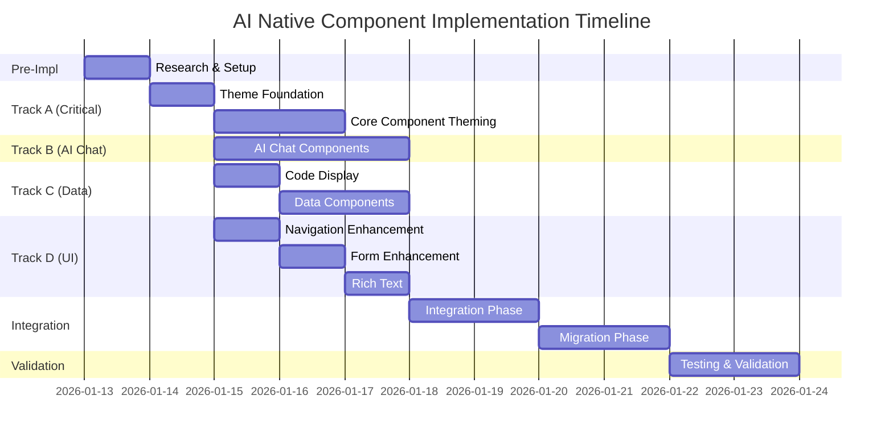

# AI Native Theme Component System - Enhanced Implementation Plan v2.0

**Status:** Ready for Approval
**Last Updated:** 2026-01-11
**Estimated Duration:** 10-14 working days (with parallel tracks)

---

## Executive Summary

This enhanced plan implements a unified component system themed with the "AI Native" design language for Turbocat. The plan incorporates parallel development tracks, comprehensive testing strategies, integration phases, and validation gates to ensure high-quality delivery.

### Key Enhancements from v1.0
- ✅ **Verified Stack Compatibility** (React 19, Next.js 16, Tailwind v4)
- ✅ **Parallel Development Tracks** (4 concurrent tracks)
- ✅ **Comprehensive Testing per Phase**
- ✅ **Integration & Validation Phase**
- ✅ **Current Codebase Migration Strategy**
- ✅ **Performance Budgets & Monitoring**
- ✅ **Automated Accessibility Testing**
- ✅ **Visual Regression Testing with Storybook**

---

## 0. Stack Compatibility Verification ✅

### Current Stack (Verified Compatible)

| Package | Installed | AI Native Requirement | Status |
|---------|-----------|----------------------|--------|
| React | **19.2.1** | React 19 | ✅ Compatible |
| Next.js | **16.0.10** | Next.js 14+ | ✅ Compatible |
| Tailwind CSS | **4.1.13** | Tailwind v4 | ✅ Compatible |
| AI SDK | **5.0.51** | AI SDK v5+ | ✅ Compatible |
| Radix UI | 14 components | Any version | ✅ Compatible |
| Framer Motion | **12.24.10** | Any version | ✅ Compatible |
| Storybook | **10.1.11** | Any version | ✅ Compatible |
| Vitest | **4.0.16** | Any version | ✅ Compatible |

### AI Elements Compatibility Analysis

**Vercel AI Elements** (`/vercel/ai-elements`):
- ✅ **Built for React 19** (no forwardRef usage)
- ✅ **Built for Tailwind CSS 4**
- ✅ **Requires AI SDK v5+** (we have 5.0.51)
- ✅ **Works with shadcn/ui** (CSS Variables mode)
- ✅ **252 code snippets available** (High source reputation)

**Recommendation:** ✅ **Proceed with Vercel AI Elements**

---

## 1. Current State Analysis

### Existing Infrastructure ✅

**Already Installed Components (21):**
- accordion, alert, alert-dialog, avatar, badge
- button, card, checkbox, dialog, drawer
- dropdown-menu, input, label, progress
- radio-group, select, sonner, switch, tabs
- textarea, tooltip

**Component Usage:**
- **166 imports** across **66 files**
- Heavy usage in: tasks, repos, auth, skills, mcp, trace
- **task-chat.tsx** is the primary chat component (needs refactoring)

**Theme Status:**
- ✅ **globals.css** already configured with Tailwind v4 `@theme inline`
- ✅ **Dark mode default** with orange/teal accents
- ✅ **Custom font**: Satoshi (Fontshare CDN)
- ⚠️ **Needs AI Native theme tokens** (currently uses custom dark theme)

**Testing Infrastructure:**
- ✅ **Vitest** configured
- ✅ **Testing Library** installed
- ✅ **Storybook** configured
- ⚠️ **No visual regression testing** (needs Chromatic or similar)
- ⚠️ **No a11y testing automation** (needs axe-core)

---

## 2. AI Native Theme Specification

### 2.1 Color Palette

| Token | Value | Usage | Current Match |
|-------|-------|-------|---------------|
| `--background` | `#FAF9F7` | Main app background | ⚠️ Dark mode (#0B1120) |
| `--background-secondary` | `#F5F4F1` | Secondary surfaces | ⚠️ Needs update |
| `--surface` | `#FFFFFF` | Cards, panels | ⚠️ Dark (#1E293B) |
| `--primary` | `#D97706` | Terracotta/amber | ✅ Close (#F97316) |
| `--accent` | `#65A30D` | Sage green | ⚠️ Using teal (#14B8A6) |
| `--text` | `#1E293B` | Primary text | ✅ Matches |

**Decision Required:** Keep current dark mode as default, or switch to light mode AI Native theme?

**Recommendation:** Offer both - default to dark (current), add AI Native light mode as option.

### 2.2 Typography

| Token | AI Native Value | Current Value | Status |
|-------|----------------|---------------|--------|
| `--font-sans` | `'Inter', 'Söhne', system-ui` | `'Satoshi', system-ui` | ⚠️ Different |
| `--font-mono` | `'JetBrains Mono', 'SF Mono'` | `'JetBrains Mono', Consolas` | ✅ Close |
| `--heading-weight` | `500` | Varies | ⚠️ Needs standardization |

**Recommendation:** Keep Satoshi font (it's elegant), add AI Native weights and spacing.

### 2.3 Effects

| Token | AI Native | Current | Status |
|-------|-----------|---------|--------|
| `--radius` | `12px` | `10px` (md), `12px` (lg) | ✅ Close |
| `--shadow` | `0 1px 3px rgba(0,0,0,0.08)` | Custom | ⚠️ Needs update |
| `--transition` | `all 0.2s ease` | Varies | ⚠️ Needs standardization |

---

## 3. Parallel Development Strategy

### Development Tracks Overview



### Track Dependencies

```
Phase 0 (Pre-Implementation)
    ↓
Phase 1 (Theme Foundation) → BLOCKS ALL TRACKS
    ↓
    ├── Track A: Core Component Theming (HIGH PRIORITY)
    ├── Track B: AI Chat Components (parallel)
    ├── Track C: Data Components (parallel)
    └── Track D: UI Enhancement (parallel)
           ↓
    Integration Phase
           ↓
    Migration Phase
           ↓
    Testing & Validation Phase
```

---

## 4. Implementation Phases (Detailed)

### Phase 0: Pre-Implementation Research ✅

**Status:** ✅ COMPLETED

**Tasks Completed:**
- [x] Verify React 19 compatibility
- [x] Verify Next.js 16 compatibility
- [x] Verify Tailwind v4 compatibility
- [x] Verify AI Elements compatibility
- [x] Analyze existing component usage
- [x] Review current theme configuration

**Duration:** 1 day (COMPLETED)

---

### Phase 1: Theme Foundation (CRITICAL PATH)

**Priority:** 🔴 **BLOCKER** - All tracks depend on this
**Duration:** 1 day
**Assignable:** 1 developer

#### Tasks

1. **Update globals.css with AI Native tokens** ⏱️ 2 hours
   - [ ] Add light mode AI Native colors
   - [ ] Keep current dark mode (primary)
   - [ ] Add theme toggle support
   - [ ] Update @theme inline tokens
   - [ ] Standardize border radius (12px default)
   - [ ] Standardize shadows
   - [ ] Standardize transitions (0.2s ease)

2. **Font Configuration** ⏱️ 1 hour
   - [ ] Keep Satoshi font (already loaded)
   - [ ] Add JetBrains Mono weights
   - [ ] Standardize heading weights (500)
   - [ ] Add letter-spacing: 0

3. **Theme Testing** ⏱️ 3 hours
   - [ ] Test all existing pages with new theme
   - [ ] Verify dark mode toggle works
   - [ ] Test AI Native light mode toggle
   - [ ] Check contrast ratios (WCAG AA minimum)
   - [ ] Verify focus rings visible
   - [ ] Test with screen reader (basic)

#### Testing & Validation

**Unit Tests:**
```typescript
// lib/__tests__/theme.test.ts
describe('Theme Tokens', () => {
  it('should have all AI Native colors defined', () => {})
  it('should have proper contrast ratios (WCAG AA)', () => {})
  it('should have consistent border radius', () => {})
  it('should have standardized transitions', () => {})
})
```

**Visual Tests:**
- [ ] Storybook: Theme switcher component
- [ ] Storybook: Color palette display
- [ ] Storybook: Typography scale

**Acceptance Criteria:**
- ✅ All CSS variables defined in globals.css
- ✅ Dark mode + AI Native light mode both work
- ✅ WCAG AA contrast ratios pass
- ✅ Existing pages render correctly
- ✅ No console errors or warnings

**Rollback Plan:**
- Revert globals.css to git HEAD
- Clear browser cache
- Restart dev server

---

### Track A: Core Component Theming (Phase 2)

**Priority:** 🔴 **HIGH** - Critical path
**Duration:** 2 days
**Assignable:** 2-3 developers
**Depends On:** Phase 1

#### Tasks

**Day 1: Form & Input Components** ⏱️ 4-5 hours

1. **Button Component** ⏱️ 1 hour
   - [ ] Update default variant (AI Native primary)
   - [ ] Add ghost, outline variants
   - [ ] Update focus ring (2px, primary color)
   - [ ] Add disabled states
   - [ ] Add loading state with spinner
   - [ ] Write component tests
   - [ ] Create Storybook stories

2. **Input Components** ⏱️ 2 hours
   - [ ] input.tsx - Update border, focus ring, disabled states
   - [ ] textarea.tsx - Same updates
   - [ ] checkbox.tsx - Update check color, focus ring
   - [ ] switch.tsx - Update colors, animation
   - [ ] radio-group.tsx - Update colors, focus ring
   - [ ] label.tsx - Update typography
   - [ ] Write component tests
   - [ ] Create Storybook stories

3. **Select Component** ⏱️ 1 hour
   - [ ] Update dropdown styling
   - [ ] Update focus states
   - [ ] Add disabled state
   - [ ] Write component tests
   - [ ] Create Storybook stories

**Day 2: Layout & Feedback Components** ⏱️ 4-5 hours

4. **Card & Dialog Components** ⏱️ 2 hours
   - [ ] card.tsx - Update shadows, border radius
   - [ ] dialog.tsx - Update overlay, animations
   - [ ] alert-dialog.tsx - Update overlay, animations
   - [ ] drawer.tsx - Update styling
   - [ ] Write component tests
   - [ ] Create Storybook stories

5. **Navigation Components** ⏱️ 2 hours
   - [ ] tabs.tsx - Update indicator, active states
   - [ ] dropdown-menu.tsx - Update styling
   - [ ] accordion.tsx - Update animations
   - [ ] Write component tests
   - [ ] Create Storybook stories

6. **Feedback Components** ⏱️ 1 hour
   - [ ] alert.tsx - Update variants
   - [ ] badge.tsx - Add AI Native variants
   - [ ] progress.tsx - Update colors
   - [ ] tooltip.tsx - Update styling
   - [ ] sonner.tsx - Update toast styling
   - [ ] Write component tests
   - [ ] Create Storybook stories

#### Testing & Validation

**Component Tests (per component):**
```typescript
describe('<Button />', () => {
  it('should render all variants', () => {})
  it('should handle click events', () => {})
  it('should show loading state', () => {})
  it('should be keyboard accessible', () => {})
  it('should have correct aria attributes', () => {})
})
```

**Visual Regression:**
- [ ] Storybook: All components in light mode
- [ ] Storybook: All components in dark mode
- [ ] Storybook: All interactive states (hover, focus, active, disabled)

**Accessibility Tests:**
```typescript
import { axe } from 'vitest-axe'

it('should have no a11y violations', async () => {
  const { container } = render(<Button>Click me</Button>)
  expect(await axe(container)).toHaveNoViolations()
})
```

**Performance Budget:**
- Button component: < 2KB gzipped
- Input component: < 3KB gzipped
- Total Track A bundle: < 20KB gzipped

**Acceptance Criteria:**
- ✅ All 21 components themed consistently
- ✅ All component tests passing (90%+ coverage)
- ✅ All Storybook stories created
- ✅ No a11y violations (axe-core)
- ✅ Performance budget met

**Rollback Plan:**
- Revert components/ui/ directory to git HEAD
- Run `npm run test` to verify old tests still pass

---

### Track B: AI Chat Components (Phase 3)

**Priority:** 🟡 **HIGH** - Can run parallel with Track A
**Duration:** 3 days
**Assignable:** 2 developers
**Depends On:** Phase 1

#### Decision Point: AI Elements vs Custom

**Option A: Vercel AI Elements (RECOMMENDED)**
- ✅ Built for React 19, Tailwind v4
- ✅ Native AI SDK v5 integration
- ✅ Handles streaming, tool calls, reasoning
- ✅ shadcn/ui compatible
- ⚠️ Requires learning new API
- ⚠️ May need customization for Turbocat design

**Option B: Custom Components**
- ✅ Full control over design
- ✅ Can reuse existing task-chat.tsx patterns
- ⚠️ More development time
- ⚠️ Need to implement streaming, tool calls, etc.

**Decision:** Start with AI Elements (Option A), customize as needed.

#### Tasks

**Day 1: AI Elements Setup & Thread** ⏱️ 6 hours

1. **Install AI Elements** ⏱️ 1 hour
   ```bash
   npx ai-elements@latest
   npm i ai @ai-sdk/react zod
   ```
   - [ ] Run AI Elements CLI
   - [ ] Configure shadcn/ui integration
   - [ ] Add necessary peer dependencies
   - [ ] Verify Tailwind CSS Variables mode

2. **Create ChatThread Component** ⏱️ 3 hours
   - [ ] Base on AI Elements `<Thread />` component
   - [ ] Add Turbocat theming (AI Native colors)
   - [ ] Add virtualization for long threads (TanStack Virtual)
   - [ ] Add scroll-to-bottom button
   - [ ] Add "new message" indicator
   - [ ] Write component tests
   - [ ] Create Storybook story

3. **Create ChatMessage Component** ⏱️ 2 hours
   - [ ] Base on AI Elements `<Message />` component
   - [ ] Add user variant styling
   - [ ] Add AI variant styling
   - [ ] Add error state styling
   - [ ] Add loading state (thinking dots)
   - [ ] Write component tests
   - [ ] Create Storybook story

**Day 2: Input & Streaming** ⏱️ 6 hours

4. **Create ChatInput Component** ⏱️ 3 hours
   - [ ] Base on AI Elements `<MessageInput />` component
   - [ ] Add attachment support
   - [ ] Add keyboard shortcuts (Cmd+Enter to send)
   - [ ] Add character counter
   - [ ] Add multiline support (auto-grow)
   - [ ] Add "Stop generating" button
   - [ ] Write component tests
   - [ ] Create Storybook story

5. **Create StreamingText Component** ⏱️ 2 hours
   - [ ] Implement cursor animation
   - [ ] Add Framer Motion animations
   - [ ] Add markdown rendering (Streamdown)
   - [ ] Add syntax highlighting (Shiki)
   - [ ] Write component tests
   - [ ] Create Storybook story

6. **Create LoadingDots Component** ⏱️ 1 hour
   - [ ] Create AI thinking indicator
   - [ ] Add Framer Motion stagger animation
   - [ ] Add accessibility (aria-live="polite")
   - [ ] Write component tests
   - [ ] Create Storybook story

**Day 3: Advanced Features** ⏱️ 6 hours

7. **Create ToolCallDisplay Component** ⏱️ 2 hours
   - [ ] Base on AI Elements `<ToolCall />` component
   - [ ] Display tool name, params, result
   - [ ] Add collapsible/expandable
   - [ ] Add status indicators (pending, success, error)
   - [ ] Write component tests
   - [ ] Create Storybook story

8. **Create ReasoningPanel Component** ⏱️ 2 hours
   - [ ] Base on AI Elements `<Reasoning />` component
   - [ ] Collapsible panel
   - [ ] Show thinking steps
   - [ ] Add toggle in ChatMessage
   - [ ] Write component tests
   - [ ] Create Storybook story

9. **Create MessageReaction Component** ⏱️ 1 hour
   - [ ] Copy button with feedback
   - [ ] Regenerate button
   - [ ] Edit button (future)
   - [ ] Write component tests
   - [ ] Create Storybook story

10. **Integration Testing** ⏱️ 1 hour
    - [ ] Test full chat flow
    - [ ] Test with AI SDK streaming
    - [ ] Test tool call rendering
    - [ ] Test error states
    - [ ] Performance test (1000+ messages)

#### Testing & Validation

**Component Tests:**
```typescript
describe('<ChatThread />', () => {
  it('should render messages', () => {})
  it('should virtualize long threads', () => {})
  it('should scroll to bottom on new message', () => {})
  it('should show "new message" indicator', () => {})
})

describe('<ChatMessage />', () => {
  it('should render user messages', () => {})
  it('should render AI messages with streaming', () => {})
  it('should render tool calls', () => {})
  it('should handle errors gracefully', () => {})
})

describe('<ChatInput />', () => {
  it('should send messages on Enter', () => {})
  it('should support multiline with Shift+Enter', () => {})
  it('should handle attachments', () => {})
  it('should show character count', () => {})
})
```

**Integration Tests:**
```typescript
describe('Chat Integration', () => {
  it('should stream AI responses', async () => {})
  it('should render tool calls', async () => {})
  it('should handle errors', async () => {})
  it('should stop generation', async () => {})
})
```

**Visual Regression:**
- [ ] Storybook: All chat components
- [ ] Storybook: Chat flow (user message → AI response → tool call)
- [ ] Storybook: Error states
- [ ] Storybook: Loading states

**Performance Budget:**
- ChatThread: < 10KB gzipped
- ChatMessage: < 5KB gzipped
- Total Track B bundle: < 30KB gzipped
- Render time: < 16ms per message (60fps)

**Acceptance Criteria:**
- ✅ All chat components created and themed
- ✅ AI SDK streaming works correctly
- ✅ Tool calls render correctly
- ✅ No memory leaks with long threads
- ✅ Performance budget met
- ✅ All tests passing (90%+ coverage)

**Rollback Plan:**
- Revert components/chat/ directory
- Uninstall ai-elements if needed
- Restore task-chat.tsx from backup

---

### Track C: Data & Code Components (Phases 4 & 5)

**Priority:** 🟡 **MEDIUM** - Can run parallel
**Duration:** 3 days
**Assignable:** 1-2 developers
**Depends On:** Phase 1

#### Tasks

**Day 1: Code Display** ⏱️ 6 hours

1. **Create AI Native Monaco Theme** ⏱️ 2 hours
   - [ ] Create `lib/themes/monaco-ai-native-theme.ts`
   - [ ] Define light mode colors
   - [ ] Define dark mode colors
   - [ ] Add to Monaco Editor configuration
   - [ ] Test with TypeScript, JavaScript, Python
   - [ ] Document color choices

2. **Create CodeBlock Component** ⏱️ 3 hours
   - [ ] Use Shiki for syntax highlighting
   - [ ] Add language detection badge
   - [ ] Add copy-to-clipboard button
   - [ ] Add line numbers (optional)
   - [ ] Add filename display
   - [ ] Support dark/light themes
   - [ ] Write component tests
   - [ ] Create Storybook story

3. **Create InlineCode Component** ⏱️ 1 hour
   - [ ] Simple inline `<code>` styling
   - [ ] Match AI Native theme
   - [ ] Write component tests
   - [ ] Create Storybook story

**Day 2: Data Table** ⏱️ 6 hours

4. **Install TanStack Table** ⏱️ 1 hour
   ```bash
   npm i @tanstack/react-table
   ```

5. **Create DataTable Component** ⏱️ 4 hours
   - [ ] Headless table with TanStack Table
   - [ ] Add sorting (column headers)
   - [ ] Add filtering (search input)
   - [ ] Add pagination controls
   - [ ] Add row selection (checkboxes)
   - [ ] Add empty state
   - [ ] Theme with AI Native colors
   - [ ] Write component tests
   - [ ] Create Storybook story

6. **Create EmptyState Component** ⏱️ 1 hour
   - [ ] Illustration + message + CTA
   - [ ] Multiple variants (no data, no results, error)
   - [ ] Write component tests
   - [ ] Create Storybook story

**Day 3: Virtual List & Diff Viewer** ⏱️ 6 hours

7. **Install TanStack Virtual** ⏱️ 1 hour
   ```bash
   npm i @tanstack/react-virtual
   ```

8. **Create VirtualList Component** ⏱️ 3 hours
   - [ ] Virtualized list with TanStack Virtual
   - [ ] Support variable row heights
   - [ ] Support infinite scroll
   - [ ] Add loading state
   - [ ] Theme with AI Native colors
   - [ ] Write component tests
   - [ ] Create Storybook story

9. **Update DiffViewer Theme** ⏱️ 2 hours
   - [ ] Update file-diff-viewer.tsx styling
   - [ ] Match AI Native colors
   - [ ] Improve mobile responsiveness
   - [ ] Write component tests
   - [ ] Update Storybook story

#### Testing & Validation

**Component Tests:**
```typescript
describe('<CodeBlock />', () => {
  it('should highlight syntax correctly', () => {})
  it('should copy code to clipboard', () => {})
  it('should show language badge', () => {})
})

describe('<DataTable />', () => {
  it('should sort columns', () => {})
  it('should filter rows', () => {})
  it('should paginate', () => {})
  it('should select rows', () => {})
})

describe('<VirtualList />', () => {
  it('should virtualize large lists', () => {})
  it('should handle variable row heights', () => {})
  it('should infinite scroll', () => {})
})
```

**Performance Budget:**
- CodeBlock: < 8KB gzipped (+ Shiki bundle)
- DataTable: < 15KB gzipped (+ TanStack Table)
- VirtualList: < 5KB gzipped (+ TanStack Virtual)
- Total Track C bundle: < 40KB gzipped

**Acceptance Criteria:**
- ✅ All components created and themed
- ✅ Monaco theme applied
- ✅ DataTable sorts, filters, paginates correctly
- ✅ VirtualList handles 10,000+ items smoothly
- ✅ Performance budget met
- ✅ All tests passing (90%+ coverage)

**Rollback Plan:**
- Revert components/code/ and components/data/
- Uninstall @tanstack packages if needed

---

### Track D: UI Enhancement (Phases 6, 7, 8)

**Priority:** 🟢 **LOW** - Can run parallel
**Duration:** 3 days
**Assignable:** 1 developer
**Depends On:** Phase 1

#### Tasks

**Day 1: Navigation** ⏱️ 6 hours

1. **Install cmdk** ⏱️ 1 hour
   ```bash
   npm i cmdk
   npx shadcn@latest add command
   ```

2. **Create CommandPalette Component** ⏱️ 4 hours
   - [ ] Base on shadcn command component
   - [ ] Add keyboard shortcut (Cmd+K)
   - [ ] Add recent commands
   - [ ] Add command categories
   - [ ] Add search
   - [ ] Theme with AI Native colors
   - [ ] Write component tests
   - [ ] Create Storybook story

3. **Add Additional shadcn Components** ⏱️ 1 hour
   ```bash
   npx shadcn@latest add sheet skeleton separator scroll-area popover
   ```

**Day 2: Forms** ⏱️ 6 hours

4. **Install React Hook Form** ⏱️ 1 hour
   ```bash
   npm i react-hook-form @hookform/resolvers
   ```

5. **Create Form Wrapper Components** ⏱️ 3 hours
   - [ ] FormField composable
   - [ ] FormMessage error component
   - [ ] Inline validation UI
   - [ ] Theme with AI Native colors
   - [ ] Write component tests
   - [ ] Create Storybook story

6. **Add shadcn Form Components** ⏱️ 2 hours
   ```bash
   npx shadcn@latest add slider calendar date-picker
   ```
   - [ ] Theme new components
   - [ ] Write component tests
   - [ ] Create Storybook stories

**Day 3: Rich Text (Optional)** ⏱️ 6 hours

7. **Install Tiptap** ⏱️ 1 hour
   ```bash
   npm i @tiptap/react @tiptap/starter-kit @tiptap/extension-markdown
   ```

8. **Create RichTextEditor Component** ⏱️ 4 hours
   - [ ] Tiptap editor with AI Native theme
   - [ ] Add markdown shortcuts
   - [ ] Add toolbar (bold, italic, link, etc.)
   - [ ] Add preview mode
   - [ ] Write component tests
   - [ ] Create Storybook story

9. **Create MarkdownRenderer Component** ⏱️ 1 hour
   - [ ] Simple markdown → HTML renderer
   - [ ] Use existing Streamdown library
   - [ ] Write component tests
   - [ ] Create Storybook story

#### Testing & Validation

**Component Tests:**
```typescript
describe('<CommandPalette />', () => {
  it('should open with Cmd+K', () => {})
  it('should filter commands', () => {})
  it('should execute commands', () => {})
})

describe('<FormField />', () => {
  it('should show validation errors', () => {})
  it('should support inline validation', () => {})
})

describe('<RichTextEditor />', () => {
  it('should render editor', () => {})
  it('should support markdown shortcuts', () => {})
  it('should toggle preview', () => {})
})
```

**Performance Budget:**
- CommandPalette: < 10KB gzipped (+ cmdk)
- Form components: < 5KB gzipped (+ React Hook Form)
- RichTextEditor: < 15KB gzipped (+ Tiptap)
- Total Track D bundle: < 50KB gzipped

**Acceptance Criteria:**
- ✅ All components created and themed
- ✅ Command palette works with keyboard
- ✅ Forms validate inline
- ✅ Rich text editor supports markdown
- ✅ Performance budget met
- ✅ All tests passing (90%+ coverage)

**Rollback Plan:**
- Revert components/navigation/ and components/forms/
- Uninstall new packages if needed

---

## 5. Integration Phase (Days 11-12)

**Priority:** 🔴 **CRITICAL**
**Duration:** 2 days
**Assignable:** All developers
**Depends On:** All tracks completed

### Goals

1. Integrate all new components into existing pages
2. Test cross-component interactions
3. Verify consistent theming across app
4. Performance optimization

### Tasks

**Day 1: Component Integration** ⏱️ 6 hours

1. **Create Component Composition Tests** ⏱️ 2 hours
   - [ ] Test Button + Dialog
   - [ ] Test ChatThread + ChatInput
   - [ ] Test DataTable + Card
   - [ ] Test Form + Input components

2. **Verify Theme Consistency** ⏱️ 2 hours
   - [ ] Visual audit of all pages
   - [ ] Check color usage
   - [ ] Check typography
   - [ ] Check spacing
   - [ ] Check animations

3. **Performance Optimization** ⏱️ 2 hours
   - [ ] Bundle size analysis
   - [ ] Code splitting review
   - [ ] Lazy loading implementation
   - [ ] Image optimization

**Day 2: Integration Testing** ⏱️ 6 hours

4. **End-to-End Testing** ⏱️ 4 hours
   - [ ] Test task creation flow
   - [ ] Test chat flow
   - [ ] Test repo management
   - [ ] Test skills management
   - [ ] Test settings page

5. **Cross-Browser Testing** ⏱️ 1 hour
   - [ ] Chrome
   - [ ] Firefox
   - [ ] Safari
   - [ ] Edge

6. **Mobile Responsiveness** ⏱️ 1 hour
   - [ ] Test on mobile (375px)
   - [ ] Test on tablet (768px)
   - [ ] Test on desktop (1440px)

### Testing & Validation

**Integration Tests:**
```typescript
describe('Integration Tests', () => {
  it('should create and send chat message', async () => {})
  it('should create task and navigate to chat', async () => {})
  it('should render data table with actions', async () => {})
  it('should open command palette and execute command', async () => {})
})
```

**Performance Metrics:**
- Total bundle size: < 300KB gzipped (baseline)
- First Contentful Paint: < 1.5s
- Time to Interactive: < 3s
- Lighthouse score: > 90

**Acceptance Criteria:**
- ✅ All components integrate smoothly
- ✅ No theme inconsistencies
- ✅ Performance metrics met
- ✅ All integration tests passing
- ✅ Cross-browser compatible
- ✅ Mobile responsive

---

## 6. Migration Phase (Days 13-14)

**Priority:** 🟡 **HIGH**
**Duration:** 2 days
**Assignable:** 2-3 developers
**Depends On:** Integration phase

### Goals

1. Migrate existing pages to new components
2. Refactor task-chat.tsx with new chat components
3. Update all pages with new theme
4. Verify no regressions

### Tasks

**Day 1: Chat Migration** ⏱️ 6 hours

1. **Refactor task-chat.tsx** ⏱️ 5 hours
   - [ ] Replace custom chat UI with ChatThread
   - [ ] Replace message rendering with ChatMessage
   - [ ] Replace input with ChatInput
   - [ ] Add tool call rendering
   - [ ] Add reasoning panel
   - [ ] Test extensively

2. **Update Chat Tests** ⏱️ 1 hour
   - [ ] Update existing tests
   - [ ] Add new tests for new features

**Day 2: Page Migrations** ⏱️ 6 hours

3. **Update Task Pages** ⏱️ 2 hours
   - [ ] app/tasks/page.tsx
   - [ ] app/tasks/[id]/page.tsx
   - [ ] Update with new components

4. **Update Repo Pages** ⏱️ 2 hours
   - [ ] Update repo layout components
   - [ ] Update repo selector
   - [ ] Update PR/issues lists

5. **Update Settings & Auth** ⏱️ 2 hours
   - [ ] Update settings page
   - [ ] Update auth pages
   - [ ] Update skills dashboard

### Testing & Validation

**Regression Tests:**
```typescript
describe('Migration Regression Tests', () => {
  it('should not break existing task flow', async () => {})
  it('should not break existing repo flow', async () => {})
  it('should not break existing auth flow', async () => {})
})
```

**Acceptance Criteria:**
- ✅ All pages migrated
- ✅ task-chat.tsx refactored successfully
- ✅ No functionality regressions
- ✅ All tests passing
- ✅ Performance maintained

---

## 7. Testing & Validation Phase (Days 15-16)

**Priority:** 🔴 **CRITICAL**
**Duration:** 2 days
**Assignable:** All developers + QA
**Depends On:** Migration phase

### Goals

1. Comprehensive testing across all dimensions
2. Accessibility audit
3. Performance audit
4. Visual regression testing
5. User acceptance testing

### Testing Checklist

#### Automated Tests ✅

**Unit Tests:**
- [ ] All components have unit tests
- [ ] All utilities have unit tests
- [ ] Coverage > 90%

**Integration Tests:**
- [ ] All critical flows tested
- [ ] All API routes tested
- [ ] All error paths tested

**E2E Tests:**
- [ ] Task creation flow
- [ ] Chat flow
- [ ] Repo management flow
- [ ] Settings flow

**Visual Regression:**
- [ ] Run Chromatic (or equivalent)
- [ ] Review all visual changes
- [ ] Approve or fix

#### Manual Tests ✅

**Accessibility:**
- [ ] Run axe DevTools on all pages
- [ ] Test with screen reader (NVDA/JAWS)
- [ ] Test keyboard navigation
- [ ] Verify ARIA attributes
- [ ] Check color contrast (WCAG AA)
- [ ] Test with reduced motion

**Performance:**
- [ ] Run Lighthouse on all pages
- [ ] Check bundle sizes
- [ ] Check First Contentful Paint
- [ ] Check Time to Interactive
- [ ] Check Cumulative Layout Shift

**Cross-Browser:**
- [ ] Chrome (latest)
- [ ] Firefox (latest)
- [ ] Safari (latest)
- [ ] Edge (latest)

**Responsive:**
- [ ] Mobile (375px)
- [ ] Mobile landscape (667px)
- [ ] Tablet (768px)
- [ ] Laptop (1024px)
- [ ] Desktop (1440px)
- [ ] Large desktop (1920px)

**Theme Switching:**
- [ ] Test dark → light switch
- [ ] Test light → dark switch
- [ ] Verify no flash of unstyled content
- [ ] Verify persistence across sessions

**Error Handling:**
- [ ] Test network errors
- [ ] Test API errors
- [ ] Test validation errors
- [ ] Test loading states

### Acceptance Criteria

**Code Quality:**
- ✅ ESLint passes
- ✅ TypeScript compiles
- ✅ Prettier formatted
- ✅ No console errors/warnings

**Testing:**
- ✅ All tests passing
- ✅ Coverage > 90%
- ✅ No critical bugs

**Performance:**
- ✅ Lighthouse > 90
- ✅ Bundle size < 300KB gzipped
- ✅ FCP < 1.5s
- ✅ TTI < 3s

**Accessibility:**
- ✅ No axe violations
- ✅ Keyboard navigable
- ✅ Screen reader friendly
- ✅ WCAG AA compliant

**Compatibility:**
- ✅ Works in all browsers
- ✅ Works on all devices
- ✅ Works in dark/light modes

---

## 8. Dependencies Installation Plan

### Required Packages

```bash
# Core additions (Track B)
npx ai-elements@latest
npm i ai @ai-sdk/react zod

# Data components (Track C)
npm i @tanstack/react-table @tanstack/react-virtual

# Navigation (Track D)
npm i cmdk
npx shadcn@latest add command sheet skeleton separator scroll-area popover

# Forms (Track D)
npm i react-hook-form @hookform/resolvers
npx shadcn@latest add slider calendar date-picker

# Rich text (Track D - Optional)
npm i @tiptap/react @tiptap/starter-kit @tiptap/extension-markdown

# Charts (Future - Optional)
npm i recharts
```

### shadcn/ui Components to Add

```bash
# Navigation
npx shadcn@latest add command sheet breadcrumb navigation-menu

# Layout
npx shadcn@latest add skeleton separator scroll-area resizable

# Popovers
npx shadcn@latest add popover hover-card context-menu menubar

# Interaction
npx shadcn@latest add toggle toggle-group collapsible

# Forms
npx shadcn@latest add slider calendar date-picker

# Optional
npx shadcn@latest add carousel
```

### Dev Dependencies (Testing)

```bash
# Visual regression testing
npm i -D @chromatic-com/storybook chromatic

# Accessibility testing
npm i -D vitest-axe @axe-core/react

# Performance testing
npm i -D @sitespeed.io/lighthouse
```

---

## 9. Performance Budgets

### Bundle Size Budgets

| Category | Budget | Current | Status |
|----------|--------|---------|--------|
| Core UI (Track A) | 20KB | TBD | ⏳ |
| AI Chat (Track B) | 30KB | TBD | ⏳ |
| Data (Track C) | 40KB | TBD | ⏳ |
| UI Enhancement (Track D) | 50KB | TBD | ⏳ |
| **Total Additional** | **140KB** | **TBD** | ⏳ |
| **Total App (with current)** | **< 300KB** | **~160KB** | ✅ |

### Runtime Performance Budgets

| Metric | Budget | Current | Status |
|--------|--------|---------|--------|
| First Contentful Paint | < 1.5s | TBD | ⏳ |
| Time to Interactive | < 3s | TBD | ⏳ |
| Cumulative Layout Shift | < 0.1 | TBD | ⏳ |
| Total Blocking Time | < 300ms | TBD | ⏳ |
| Lighthouse Performance | > 90 | TBD | ⏳ |

### Component Render Performance

| Component | Budget | Notes |
|-----------|--------|-------|
| ChatMessage | < 16ms | 60fps |
| DataTable (100 rows) | < 100ms | Initial render |
| VirtualList (1000 items) | < 50ms | Initial render |
| CodeBlock | < 50ms | With syntax highlighting |

---

## 10. Accessibility Standards

### WCAG 2.1 Level AA Compliance

#### Visual

- [ ] **Color Contrast:** All text 4.5:1 minimum
- [ ] **Large Text:** 3:1 minimum (18pt+ or 14pt+ bold)
- [ ] **UI Components:** 3:1 minimum
- [ ] **Focus Indicators:** Visible, 3:1 contrast
- [ ] **No Color Alone:** Never use color as only indicator

#### Keyboard

- [ ] **Tab Order:** Logical and intuitive
- [ ] **Focus Management:** No keyboard traps
- [ ] **Shortcuts:** Document all keyboard shortcuts
- [ ] **Skip Links:** Provide skip to main content
- [ ] **Modal Focus:** Trap focus in dialogs

#### Screen Readers

- [ ] **Landmarks:** Proper use of nav, main, aside
- [ ] **Headings:** Logical h1-h6 hierarchy
- [ ] **Alt Text:** All images have alt
- [ ] **ARIA Labels:** Where native semantics insufficient
- [ ] **Live Regions:** For dynamic content

#### Content

- [ ] **Page Titles:** Descriptive and unique
- [ ] **Link Text:** Descriptive (no "click here")
- [ ] **Error Messages:** Clear and actionable
- [ ] **Form Labels:** All inputs have labels
- [ ] **Required Fields:** Clearly indicated

### Testing Tools

1. **Automated:** axe DevTools, Lighthouse
2. **Manual:** NVDA (Windows), JAWS, VoiceOver (Mac)
3. **Keyboard:** Manual testing
4. **Contrast:** WebAIM Contrast Checker

---

## 11. Risk Assessment & Mitigation

| Risk | Likelihood | Impact | Mitigation |
|------|------------|--------|------------|
| **AI Elements breaking changes** | Low | High | Pin version, thorough testing, fallback to custom |
| **Bundle size exceeds budget** | Medium | Medium | Code splitting, lazy loading, tree shaking |
| **Performance regression** | Medium | High | Performance monitoring, benchmarks, optimization |
| **Accessibility violations** | Low | High | Automated testing, manual audits, user testing |
| **Dark mode contrast issues** | Medium | Medium | Contrast checking, user testing, adjustments |
| **Theme inconsistencies** | Medium | Low | Design system, Storybook, visual regression |
| **Migration breaks existing features** | Low | Critical | Comprehensive testing, feature flags, rollback plan |
| **Timeline overrun** | Medium | Medium | Parallel tracks, clear priorities, MVP scope |
| **Browser compatibility** | Low | Medium | Cross-browser testing, polyfills, progressive enhancement |
| **Mobile responsiveness issues** | Low | Medium | Mobile-first approach, responsive testing |

---

## 12. Timeline Summary

### Parallel Development Estimate

| Phase | Duration | Dependencies |
|-------|----------|--------------|
| **Phase 0:** Pre-Implementation ✅ | 1 day | None |
| **Phase 1:** Theme Foundation | 1 day | Phase 0 |
| **Track A:** Core Theming | 2 days | Phase 1 |
| **Track B:** AI Chat (parallel) | 3 days | Phase 1 |
| **Track C:** Data (parallel) | 3 days | Phase 1 |
| **Track D:** UI (parallel) | 3 days | Phase 1 |
| **Integration Phase** | 2 days | All tracks |
| **Migration Phase** | 2 days | Integration |
| **Testing & Validation** | 2 days | Migration |

**Total Duration:** 10-14 working days (with 4 parallel tracks)

**Sequential Estimate (for comparison):** 18-20 working days

**Savings:** 4-8 days (30-40% faster)

---

## 13. Success Metrics

### Quantitative Metrics

1. **Code Coverage:** > 90%
2. **Lighthouse Score:** > 90
3. **Bundle Size:** < 300KB gzipped
4. **FCP:** < 1.5s
5. **TTI:** < 3s
6. **CLS:** < 0.1
7. **A11y Violations:** 0 critical, < 5 minor
8. **Cross-Browser Pass Rate:** 100%
9. **Mobile Responsive:** 100%
10. **Test Pass Rate:** 100%

### Qualitative Metrics

1. **Design Consistency:** Visual audit passes
2. **User Feedback:** Positive (if UAT conducted)
3. **Developer Experience:** Positive (Storybook, documentation)
4. **Maintainability:** Clear component structure, good docs
5. **Accessibility:** Meets WCAG 2.1 AA

---

## 14. Rollback Strategy

### Per-Phase Rollback

Each phase has its own rollback plan documented above.

### Full Rollback

If catastrophic issues arise:

1. **Revert Git:**
   ```bash
   git revert <commit-range>
   git push origin main
   ```

2. **Revert Dependencies:**
   ```bash
   git checkout HEAD~1 package.json
   npm install
   ```

3. **Clear Caches:**
   ```bash
   rm -rf .next node_modules/.cache
   npm run build
   ```

4. **Verify:**
   - Run all tests
   - Check all pages render
   - Verify no console errors

### Emergency Hotfix

If production issues:

1. Create hotfix branch from previous stable tag
2. Apply minimal fix
3. Test thoroughly
4. Deploy hotfix
5. Post-mortem analysis

---

## 15. Documentation Plan

### Developer Documentation

1. **Component Library:**
   - [ ] Storybook stories for all components
   - [ ] Component API documentation
   - [ ] Usage examples
   - [ ] Best practices

2. **Design System:**
   - [ ] Color palette documentation
   - [ ] Typography scale
   - [ ] Spacing system
   - [ ] Component patterns

3. **Theme Customization:**
   - [ ] How to extend the theme
   - [ ] How to add new colors
   - [ ] How to customize components

### User Documentation

1. **Changelog:**
   - [ ] List all visual changes
   - [ ] List all new features
   - [ ] List any breaking changes

2. **Migration Guide:**
   - [ ] For users (if any UI changes affect workflows)
   - [ ] For developers (if API changes)

---

## 16. Approval Checklist

Before proceeding with implementation, verify:

- [ ] **Plan reviewed** by tech lead
- [ ] **Timeline approved** by PM
- [ ] **Resources allocated** (developers, designers)
- [ ] **Dependencies approved** (new npm packages)
- [ ] **Risk assessment reviewed**
- [ ] **Performance budgets approved**
- [ ] **A11y standards approved**
- [ ] **Testing strategy approved**
- [ ] **Rollback plan approved**

---

## 17. Post-Implementation

### Monitoring

1. **Performance:**
   - Set up performance monitoring (Vercel Analytics)
   - Track bundle sizes over time
   - Track Lighthouse scores

2. **Errors:**
   - Monitor error logs (Sentry or similar)
   - Track error rates
   - Set up alerts

3. **Usage:**
   - Track component usage
   - Track theme switching
   - Track user feedback

### Iteration

1. **Gather feedback** from users and developers
2. **Identify pain points** and areas for improvement
3. **Prioritize fixes** and enhancements
4. **Schedule follow-up** work

### Knowledge Sharing

1. **Demo session** for team
2. **Documentation review** with team
3. **Lessons learned** session
4. **Update onboarding** materials

---

## 18. Open Questions

### Design Decisions

1. **Theme Default:** Dark mode (current) or AI Native light mode?
   - **Recommendation:** Keep dark mode default, add AI Native light mode as option

2. **Font:** Keep Satoshi or switch to Inter/Söhne?
   - **Recommendation:** Keep Satoshi (already loaded, elegant)

3. **Chat Components:** AI Elements or custom?
   - **Recommendation:** Start with AI Elements, customize as needed

4. **Rich Text Editor:** Include in MVP or defer?
   - **Recommendation:** Defer to Phase 2 (not critical for MVP)

### Technical Decisions

1. **Storybook Deployment:** Deploy publicly or keep internal?
   - **Recommendation:** Deploy to Chromatic for team access

2. **Visual Regression:** Use Chromatic or Percy or manual?
   - **Recommendation:** Chromatic (integrates with Storybook)

3. **A11y Testing:** Automated only or include manual?
   - **Recommendation:** Both (automated for CI, manual for critical flows)

---

## 19. Appendix

### A. Useful Resources

- [shadcn/ui Theming](https://ui.shadcn.com/docs/theming)
- [Tailwind v4 Theming](https://ui.shadcn.com/docs/tailwind-v4)
- [Vercel AI Elements](https://github.com/vercel/ai-elements)
- [TanStack Table](https://tanstack.com/table/latest)
- [TanStack Virtual](https://tanstack.com/virtual/latest)
- [cmdk](https://cmdk.paco.me)
- [Tiptap](https://tiptap.dev)
- [React Hook Form](https://react-hook-form.com)
- [WCAG 2.1 Guidelines](https://www.w3.org/WAI/WCAG21/quickref/)

### B. Component Checklist Template

For each component:

```markdown
## <ComponentName>

- [ ] Component file created
- [ ] TypeScript types defined
- [ ] AI Native theme applied
- [ ] Props documented
- [ ] Unit tests written
- [ ] Integration tests written (if applicable)
- [ ] Storybook story created
- [ ] A11y tested (axe-core)
- [ ] Keyboard tested
- [ ] Screen reader tested
- [ ] Dark/light mode tested
- [ ] Responsive tested
- [ ] Performance tested
- [ ] Documentation written
- [ ] Code reviewed
```

### C. Testing Checklist Template

For each phase:

```markdown
## Phase X Testing

### Unit Tests
- [ ] All components tested
- [ ] All utilities tested
- [ ] Coverage > 90%

### Integration Tests
- [ ] Cross-component interactions tested
- [ ] API integrations tested
- [ ] Error handling tested

### Visual Tests
- [ ] Storybook stories created
- [ ] Visual regression tested (Chromatic)

### A11y Tests
- [ ] axe-core passing
- [ ] Keyboard navigation tested
- [ ] Screen reader tested

### Performance Tests
- [ ] Bundle size checked
- [ ] Render performance checked
- [ ] Memory leaks checked

### Manual Tests
- [ ] Cross-browser tested
- [ ] Responsive tested
- [ ] Dark/light mode tested
```

---

## Summary & Next Steps

### ✅ Ready for Approval

This enhanced plan provides:

1. ✅ **Verified compatibility** with current stack
2. ✅ **Parallel development** strategy (4 tracks)
3. ✅ **Comprehensive testing** per phase
4. ✅ **Integration & validation** phases
5. ✅ **Current codebase migration** strategy
6. ✅ **Performance budgets** and monitoring
7. ✅ **Accessibility standards** and testing
8. ✅ **Visual regression testing** with Storybook
9. ✅ **Risk assessment** and mitigation
10. ✅ **Rollback plans** per phase

### 🚀 Next Steps (After Approval)

1. **Create feature branch:** `feat/ai-native-theme`
2. **Set up project board** with all tasks
3. **Assign developers** to tracks
4. **Schedule kickoff meeting**
5. **Begin Phase 1:** Theme Foundation

### 📋 Approval Required

- [ ] Tech Lead approval
- [ ] PM approval
- [ ] Design approval (if designer available)
- [ ] Resource allocation confirmed

**Please review and approve before proceeding with implementation.**
